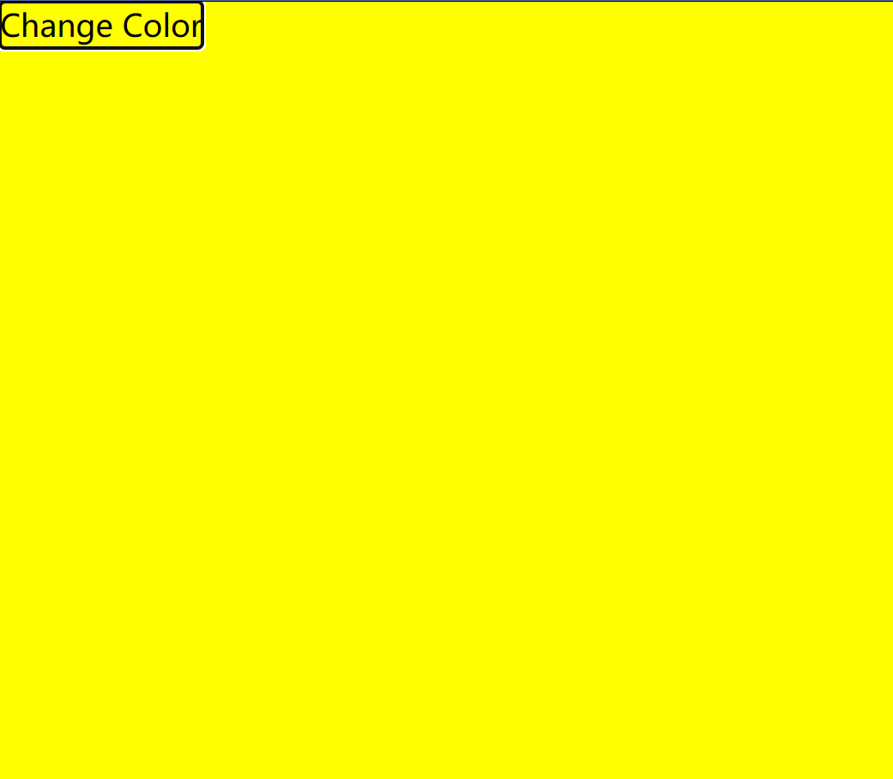
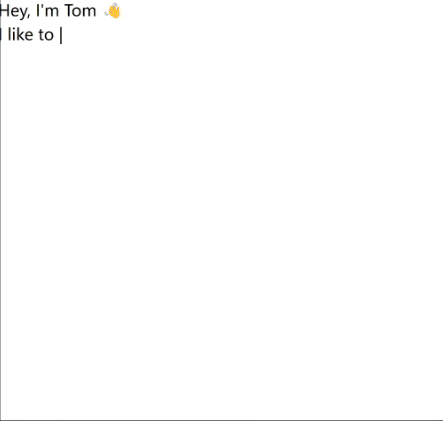
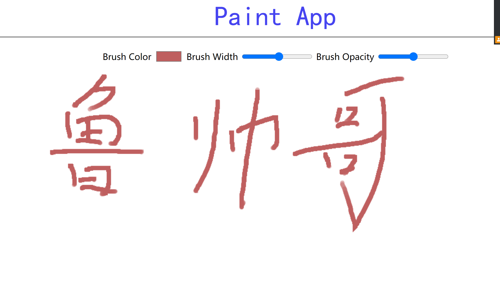

<h1 align = "center">Js和ReactJs</h1>

```md
git add .
git commit -m "commit"
git clone git@github.com:lushiheng123/JS-ReactJS.git
git checkout -b main\_
git push -u origin main
```

```md
<details>

<summary></summary>

</details>
```

# 目录

- 加减法

# 1. 加减法`useState`+`button的onclick`

<details>

<summary>ReactJs</summary>

```jsx
import React from "react";
import { useState, useEffect } from "react";
function App() {
  const [count, setCount] = useState(0);
  const number_add = () => {
    setCount((prevCount) => prevCount + 1);
  };
  const number_reduce = () => {
    setCount((prevCount) => prevCount - 1);
  };

  return (
    <div className="App">
      <button onClick={() => number_add()}>➕</button>
      <input placeholder="数量" value={count} />
      <button onClick={() => number_reduce()}>➖</button>
    </div>
  );
}

export default App;
```

</details>

# 2. `document.body.style.backgroundColor`更改整体背景颜色

<details>
<summary>
Reactjs
</summary>

```jsx
import React, { useEffect, useState } from "react";

function App() {
  const [color, setColor] = useState("red");
  const click = (color) => {
    setColor(color);
  };
  useEffect(() => {
    document.body.style.backgroundColor = color;
  }, [color]);
  return (
    <div className="App">
      <button onClick={(color) => click("yellow")}>Change Color</button>
    </div>
  );
}

export default App;
```

</details>



# 3. 滚动窗口 UI

<details>

<summary>reactjs</summary>

```jsx
import React, { useState, useEffect } from "react";

export default function App() {
  const [currentPhrase, setCurrentPhrase] = useState("");
  const phrases = ["code", "make beats", "hug puppies"];
  let sleepTime = 100;

  const sleep = (ms) => {
    return new Promise((resolve) => setTimeout(resolve, ms));
  };

  const writeLoop = async () => {
    let curPhraseIndex = 0;
    while (true) {
      let curWord = phrases[curPhraseIndex];

      for (let i = 0; i < curWord.length; i++) {
        setCurrentPhrase(curWord.substring(0, i + 1));
        await sleep(sleepTime);
      }

      await sleep(sleepTime * 10);

      for (let i = curWord.length; i > 0; i--) {
        setCurrentPhrase(curWord.substring(0, i - 1));
        await sleep(sleepTime);
      }

      await sleep(sleepTime * 5);

      curPhraseIndex = (curPhraseIndex + 1) % phrases.length;
    }
  };

  useEffect(() => {
    writeLoop();
    // eslint-disable-next-line react-hooks/exhaustive-deps
  }, []);

  return (
    <div>
      <h1>
        Hey, I'm Tom 👋
        <br />I like to {currentPhrase}
        <span id="cursor">|</span>
      </h1>
    </div>
  );
}
```

</details>



# 4. 画画

<details>

<summary>App.jsx</summary>

```jsx
import React, { useState, useRef, useEffect } from "react";

import Menu from "./Menu.jsx";
function App() {
  const [brushColor, setBrushColor] = useState("green");
  const [brushWidth, setBrushWidth] = useState(8);
  const [brushOpacity, setBrushOpacity] = useState(0.5);
  const canvasRef = useRef(null);
  const ctxRef = useRef(null);
  const [isDraw, setIsDraw] = useState(false);
  useEffect(() => {
    const canvas = canvasRef.current;
    const ctx = canvas.getContext("2d");
    ctx.lineCap = "round";
    ctx.lineJoine = "round";
    ctx.globalAlpha = brushOpacity;
    ctx.strokeStyle = brushColor;

    ctx.lineWidth = brushWidth;
    ctxRef.current = ctx;
  }, [brushColor, brushWidth, brushOpacity]);
  const startDraw = (e) => {
    ctxRef.current.beginPath();
    ctxRef.current.moveTo(e.nativeEvent.offsetX, e.nativeEvent.offsetY);
    setIsDraw(true);
  };

  const endDraw = (e) => {
    ctxRef.current.closePath();
    setIsDraw(false);
  };

  const draw = (e) => {
    if (!isDraw) {
      return;
    }
    ctxRef.current.lineTo(e.nativeEvent.offsetX, e.nativeEvent.offsetY);

    ctxRef.current.stroke();
  };
  return (
    <div className="App">
      <h1>Paint App</h1>
      <div className="draw-area">
        <Menu
          setBrushColor={setBrushColor}
          setBrushOpacity={setBrushOpacity}
          setBrushWidth={setBrushWidth}
        />

        <canvas
          width="1200px"
          height="500px"
          ref={canvasRef}
          onMouseDown={startDraw}
          onMouseUp={endDraw}
          onMouseMove={draw}
        ></canvas>
      </div>
    </div>
  );
}

export default App;
```

</details>

<details>

<summary>Menu.jsx</summary>

```jsx
import React from "react";

export default function Menu({
  setBrushColor,
  setBrushOpacity,
  setBrushWidth,
}) {
  return (
    <div className="menu">
      <label htmlFor="brush">Brush Color</label>

      <input
        type="color"
        onChange={(e) => {
          setBrushColor(e.target.value);
        }}
      />

      <label htmlFor="brush_width">Brush Width </label>
      <input
        type="range"
        min="3"
        max="20"
        onChange={(e) => {
          setBrushWidth(e.target.value);
        }}
      />

      <label htmlFor="brush_opacity">Brush Opacity</label>
      <input
        type="range"
        min="0"
        max="0.5"
        step="0.01"
        onChange={(e) => {
          setBrushOpacity(e.target.value);
        }}
      />
    </div>
  );
}
```

</details>

<details>

<summary>css</summary>

```css
@import "tailwindcss";
body {
  padding: 1rem;
}
.App {
  width: 100%;
  height: 100vh;
  display: flex;
  flex-direction: column;
  justify-content: center;
  align-items: center;
  background-image: liner-gradient(120deg, #fdfbfb 0%, #ebedee 100%);
}
h1 {
  font-family: "Lobster", cursive;
  font-size: 50px;
  color: #4644f0;
}
.draw-area {
  width: 1280px;
  height: 720px;
  border: 2px solid #808080;
  position: relative;
  background-color: white;
}
.menu {
  width: 650px;
  height: 50px;
  display: flex;
  justify-content: space-evenly;
  border-radius: 5px;
  align-items: center;
  margin: auto;
  margin-top: 10px;
}
```

</details>


